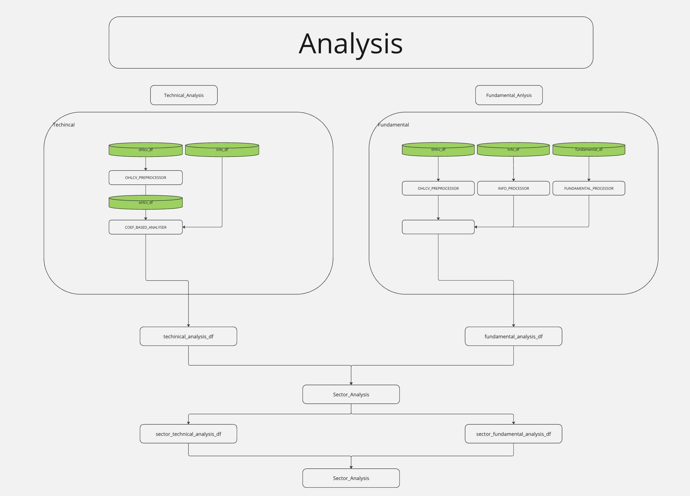

# System-Trading

# Fundamental Analysis 완성
# Processor 분리?

## Project repo 분리 필요
- 
analysis done
## main
데이터 엔지니어링을 진행한 부분

## backoffice
시스템 매매를 위해 [Main] 바탕으로 백오피스를 구현한것

### ETL

#### ETL Source
- 한국투자증권
    - ohlcv (open high low close volume etc...)
    - info (totalshares, name etc...)
- 한국전자공시시스템
    - fundamental (TotalAssets, CurrentAssets, TotalLiabilites, NetProfit etc ...)
- 한국거래소
    - KOSDAQ sector
    - KOSPI sector 

### Analysis

#### Analysis Idea
- Technical Analysis
    - Linear Coefficient Related
        - Price
        - Volume
        - VolumeTurnOver
- Fundamental Analysis
    - General Factors
        - PBR, PER etc...
    - Private Factors
        - TLR (Total Liabilities Ratio), CLR (Current Liabilities Ratio) etc ...

### 
