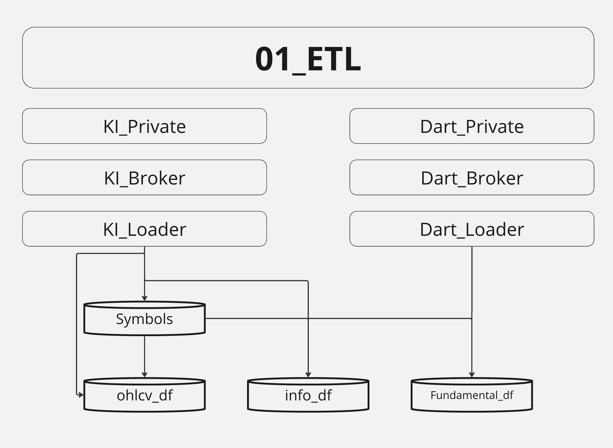
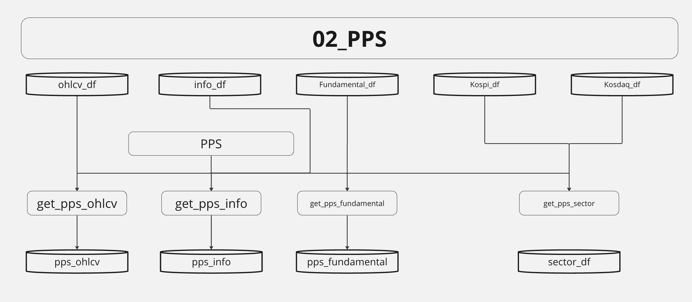
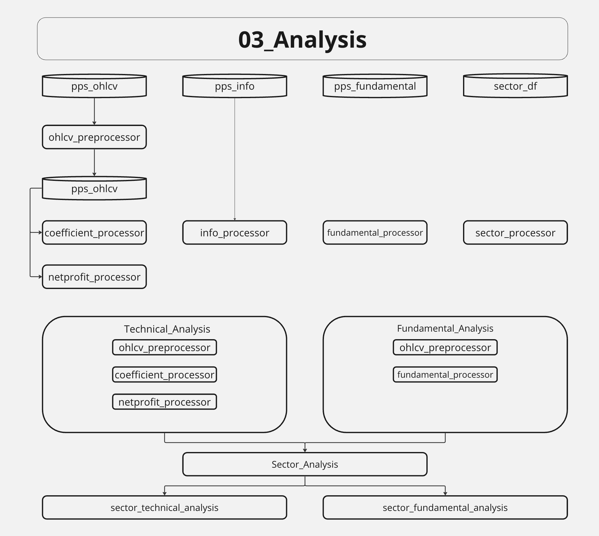

# Main_development

### Theme
- 프로젝트 메인 pipeline을 구성하기 위해 진행한 개발 directory 입니다.
    - 여기서 완성된 pipeline을 modulize 하여 product에 세팅합니다.

### ETL

- Private -> Broker -> Loader 
- Dataset
    - dynamic (개발단계에서만 local에 저장)
        - ohlcv
        - info
        - fundamental
    - static (상용 단계에서도 local에 저장)
        - kospi_sector
        - kosdaq_sector

### PPS

- 1차적인 Preprocessing
    - 주로 naming convention을 맞추기 위해 진행하는 preprocessing

### Analysis

- ML 이전에 적절한 종목을 선택하기 위한 분석 단계
    - Technical Analysis
        - 기술적인 분석
        - 차트 자체에서 얻어낸 데이터들 
            - 종가의 선형회귀계수
            - 거래량의 선형회귀계수
            - 수익률 가중편균
    - Fundamental Aanalysis
        - 기본적 분석
        - 재무제표 기반
            - PBR
            - PER 
            - TLR (Total Liabilities Ratio) 
            - CLR (Current Liabilities Ratio)
            - ...
